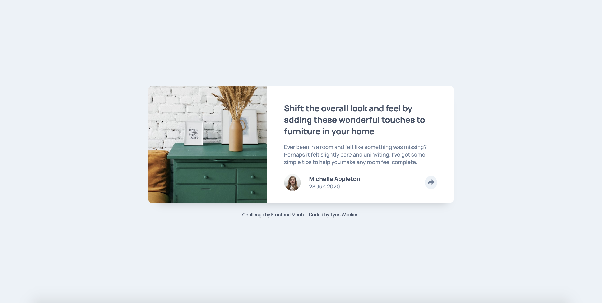

# Frontend Mentor - Article preview component solution

This is a solution to the [Article preview component challenge on Frontend Mentor](https://www.frontendmentor.io/challenges/article-preview-component-dYBN_pYFT). Frontend Mentor challenges help you improve your coding skills by building realistic projects. 

## Table of contents

- [Overview](#overview)
  - [The challenge](#the-challenge)
  - [Screenshot](#screenshot)
  - [Links](#links)
- [My process](#my-process)
  - [Built with](#built-with)
  - [What I learned](#what-i-learned)
  - [Continued development](#continued-development)
  - [Useful resources](#useful-resources)
- [Author](#author)
- [Acknowledgments](#acknowledgments)

## Overview

### The challenge

Users should be able to:

- View the optimal layout for the component depending on their device's screen size
- See the social media share links when they click the share icon

### Screenshot

### Links

- Solution URL: [Article Preview Component](https://gilded-cendol-5cd343.netlify.app)

## My process

### Built with

- Semantic HTML5 markup
- CSS custom properties
- Flexbox
- CSS Grid

### What I learned

I learned a convenient way to toggle classes in JavaScript. This will be very helpful for future projects that need that functionality.

### Continued development

I would like to continue learning how to manipulate the DOM, as well as more projects involving objects, loops and local storage.

## Author

- Website - [Tyon Weekes](https://www.tyonweekes.com)

## Acknowledgments

https://www.frontendmentor.io/solutions/article-preview-component-solution-JzJ4g2nt1

I referred to the solution above for help on the share button and learned more about the toggle function.